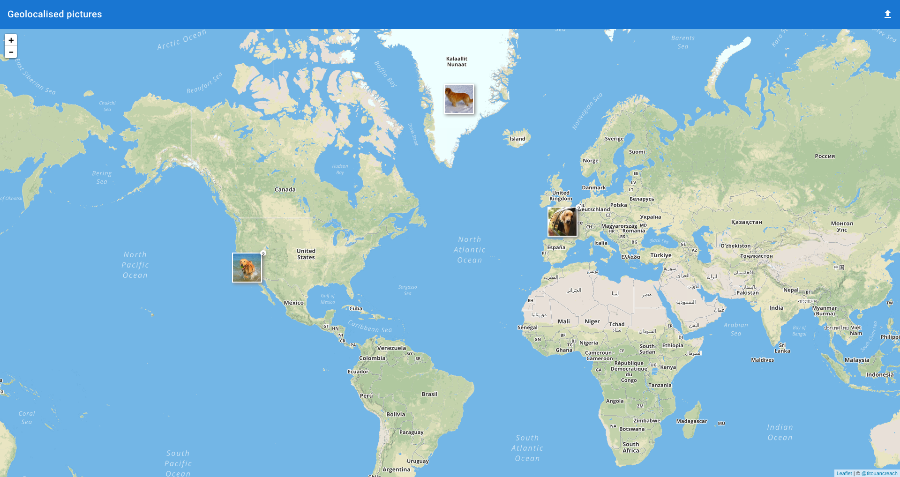
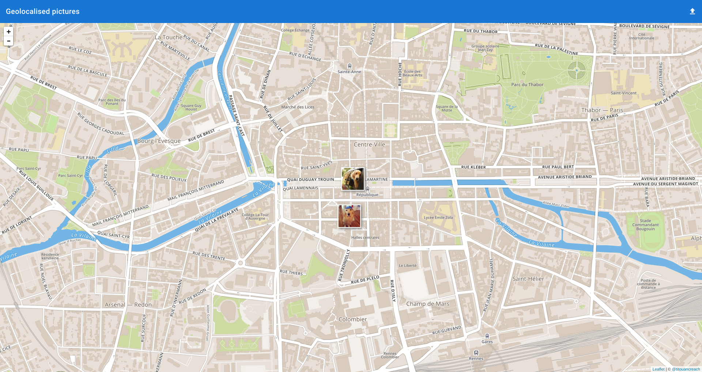
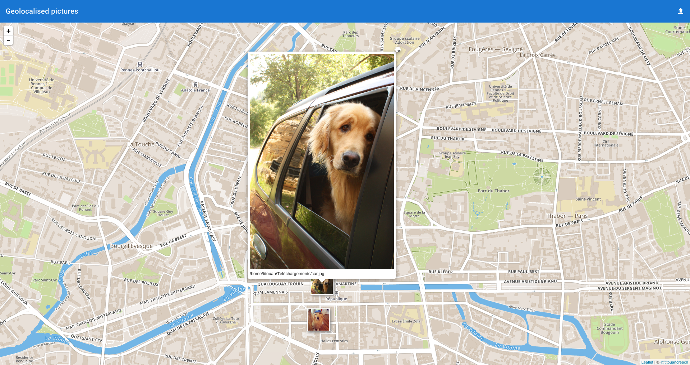
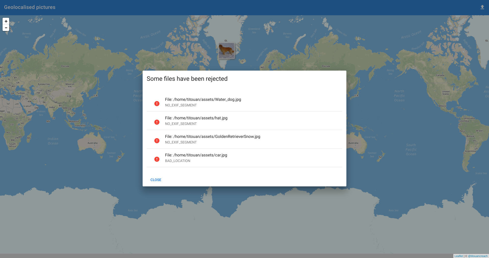

# Geopictures visu

Geopictures visu is a software running on Electron that allows to visulize geotagged photo on a map.

## Features
  - Add multiple photos
  - Error management for pictures that don't have geo tags
  - Beautiful thumbnail clustering management
  - Display the picture when clicking on the thumbnail
  - User friendly and easy to use

## Screenshot


View your photos on a map.


When clicking on a clustered image or when uploading image. The view directly fit to your pictures.


When clicking on a picture, it appears full size.


Photo with no geotags are handled and doesn't prevent other photos to load.


## Install

```
# using yarn
yarn install
yarn run build
yarn run start
```

```
# using npm
npm install
npm run build
npm run start
```


## Technologies
The software is built on top of electron and use modern javascript frameworks. It use `mapbox.js` and `leaflet`
for the map, `Vue` and `Vuetify` for the User Interface and [Leaflet.Photo](https://github.com/turban/Leaflet.Photo)
for the clustering and the picture display.

## Scripts
  - `build`: Build the software
  - `watch`: Build automatically when a source file change
  - `start`: Start the software

